# Data Analysis Project

## Introduction

In this project, we analyze data from different vehicles obtained from the [Statlog (Vehicle Silhouettes) dataset](https://archive.ics.uci.edu/dataset/149/statlog+vehicle+silhouettes). 

The dataset includes information on four types of vehicles: 
- *Bus*
- *Opel*
- *Saab*
- *Van*

Our goal is to investigate the dataset to identify the distinguishing features of these vehicles.

#### 1. Motivation
As mentioned in the dataset description, this specific combination of vehicles was selected with the expectation that the bus, van, and one of the cars would be easily distinguishable, while distinguishing between the cars themselves would be more challenging. The aim of this project is to explore the dataset and identify the key features that differentiate the vehicles.

#### 2. Datased attributes description

> These details are based on my own research and might not be correct.

- **Compactness**: Measures the general shape of the object. Higher values indicate a more compact shape.
- **Circularity**: Indicates how circular the object is, based on the ratio of area to the mean radius. Values close to 1 indicate high circularity.
- **Distance Circularity**: Ratio of the object's area to the inverse square of the average distance to the edge, measuring boundary irregularity.
- **Radius Ratio**: Difference between maximum and minimum radii, divided by the mean radius, indicating asymmetry.
- **Pr. Axis Aspect Ratio**: Ratio of the object's minor and major axes, reflecting its elongation or compactness.
- **Max. Length Aspect Ratio**: Ratio of the length perpendicular to the maximum length to the maximum length, indicating object extension.
- **Scatter Ratio**: Ratio of inertias around the minor and major axes, showing the dispersion along these axes.
- **Elongatedness**: Measures the object's elongation based on area and width after reduction.
- **Pr. Axis Rectangularity**: Measures how rectangular the object is around its main axis.
- **Max. Length Rectangularity**: Measures the rectangularity relative to the maximum length and perpendicular width.
- **Scaled Variance Along Major Axis**: Variance of point distribution along the major axis, adjusted by area.
- **Scaled Variance Along Minor Axis**: Same as for the major axis but along the minor axis.
- **Scaled Radius of Gyration**: Average variance of the major and minor axes divided by the area, showing the object's extent relative to its center of mass.
- **Skewness About Major Axis**: Asymmetry of point distribution along the major axis. High values indicate significant asymmetry.
- **Skewness About Minor Axis**: Asymmetry along the minor axis.
- **Kurtosis About Major Axis**: Sharpness of the point distribution along the major axis. Higher values indicate more concentration.
- **Kurtosis About Minor Axis**: Same as for the major axis but along the minor axis.
- **Hollows Ratio**: Measures the proportion of internal "holes" or voids relative to the object's outer surface, quantifying contour complexity.


## 2. Analyse descriptive  

### 2.1 Top 6 Features and Why 

- **Compactness**
Captures overall shape characteristics.
Differentiates between compact vs. elongated objects.
- **Circularity**
Crucial for identifying round vs. irregular shapes.
Helps in classifying objects with varying circular forms.
- **Pr. Axis Aspect Ratio**
Reflects elongation vs. compactness.
Useful for distinguishing stretched vs. symmetrical shapes.
- **Scaled Radius of Gyration**
Represents object spread around its center of mass.
Important for detecting dispersed vs. concentrated shapes.
- **Skewness About Major Axis**
Measures asymmetry along the primary axis.
Helps in classifying skewed vs. balanced objects.
- **Hollows Ratio**
Quantifies internal voids or contour complexity.
Useful for identifying hollow vs. solid structures.

**Why Not Others?**
- Distance Circularity, Scatter Ratio, Rectangularity Metrics → Possibly correlated with Circularity/Aspect Ratios.
- Kurtosis (Major/Minor) → More useful for fine texture details rather than broad classification.

### 2.2 Histograms are useful for understanding the distribution of each variable.


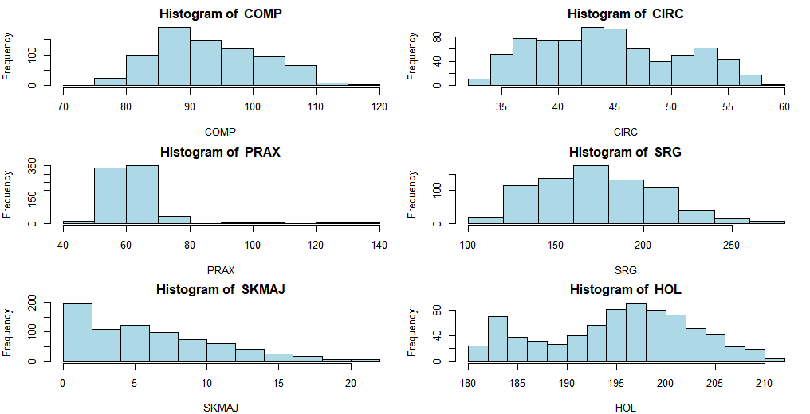


- COMP: The histogram indicates a range of values with a peak frequency around 85-90.

- CIRC: Shows a broader distribution with a small peak around 45.

- PRAX: Displays a narrow range with frequencies peaking around 60.

- SRG: Has a wide distribution (well see it better in the boxplot). With a peak around 180.

- SKMAJ: Shows a low distribution with frequencies peaking around 0.

- HOL: Indicates a distribution with two peaks around 182.5 and 197.5.

### 2.3 Boxplots are useful for visualizing the spread of data and identifying outliers.

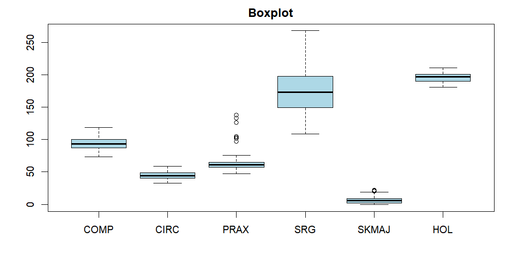


Interquartile Range (IQR): Variables with long whiskers might have a high variance. The long tail of Scaled Radius of Gyration indicates high skewness (asymmetry) or variance. This makes sense since the vehicles analyzed have a lot of difference in terms of shape and size (e.g., buses vs. cars).

The other variables have more balanced distributions. 

Outliers: Dots outside the whiskers suggest extreme values that may need further investigation. We can spot a few outliers in PR. Axis Aspect Ratio. Some elements are significantly elongated compared to the rest, this still makes sense as some buses and vans are quite long.


### 2.4 Correlation Matrix are useful for identifying relationships between variables.

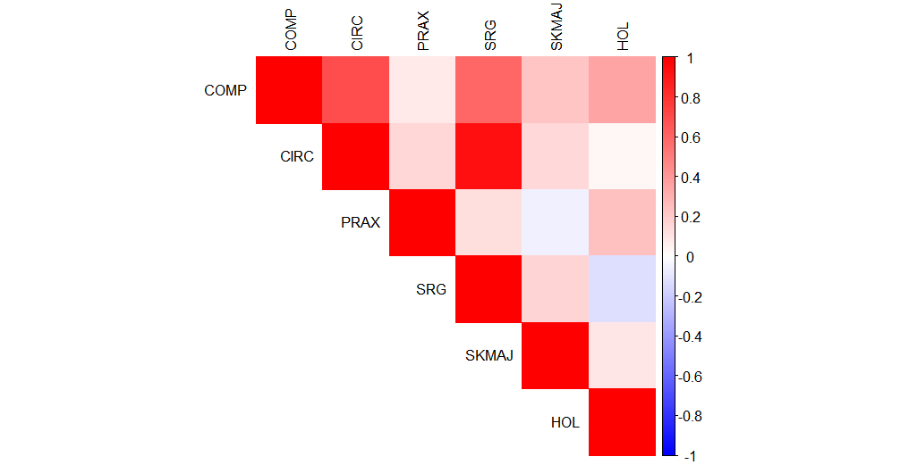

This matrix helps in understanding the relationships between variables. For instance, if COMP and CIRC have a high positive correlation, it suggests that as compactness increases, circularity also tends to increase. This trend is also visible in the scatter plot.

### 2.5 Scatter Plots are useful for visualizing relationships between two variables.

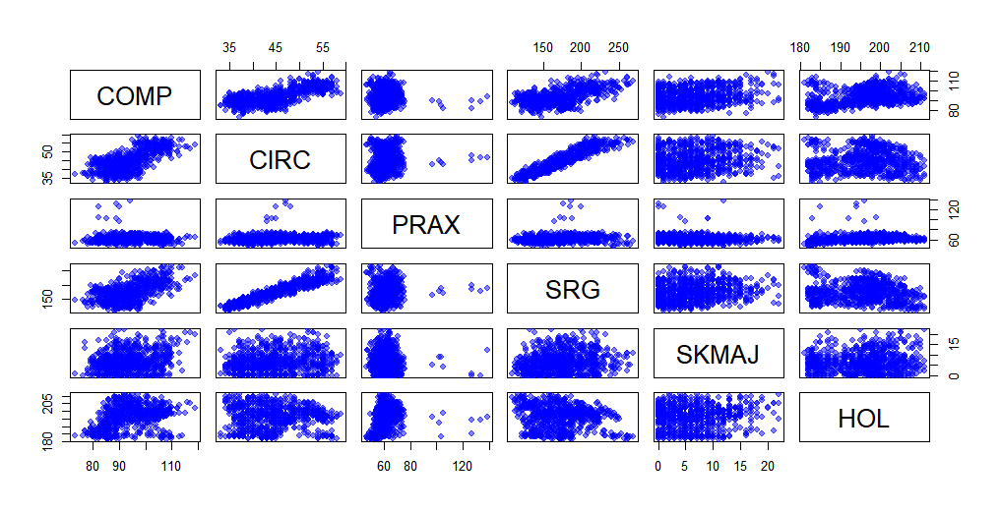

The scatter plots show the relationships between different variables. As mentionned before, COMP and CIRC have a positive correlation, indicating that as compactness increases, circularity also tends to increase. This relationship is visible in the scatter plot, where the points form a diagonal line. The correlation between CIRC and SRG is also remarkable, with a clear positive trend.

The other variables show less clear relationships, with more scattered points. This suggests that they might be less correlated or have more complex interactions.

We can still identify 'groups' on the PRAX line, this is because the range of PRAX is quite narrow, and it does contain some strong outliers which make the big group visible.

## 3. Unsupervised classification 

### 3.1 K-Means Clustering

To identify distinct groups within the dataset, we first apply the elbow method to determine the optimal number of clusters.

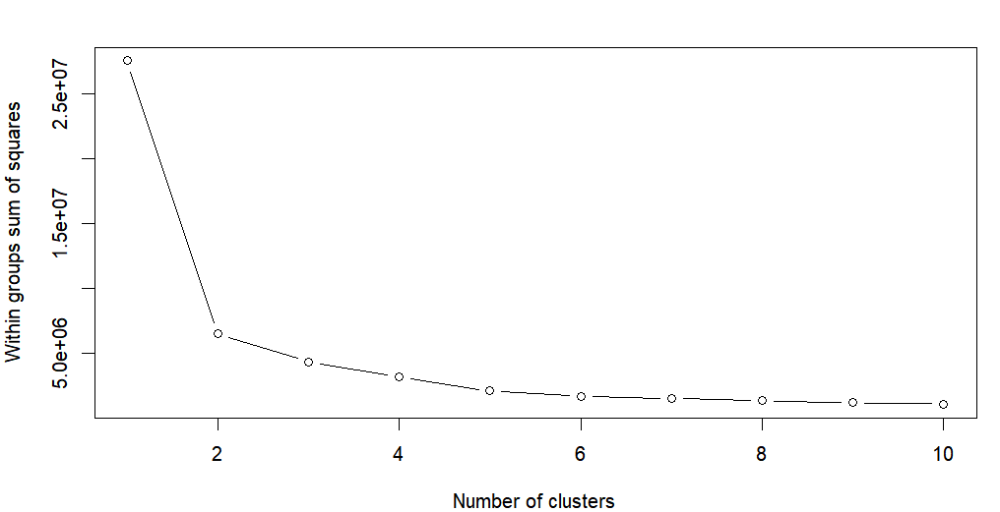

The elbow method suggests that the optimal number of clusters is 3. We then apply the K-means algorithm with 3 clusters to classify the data.

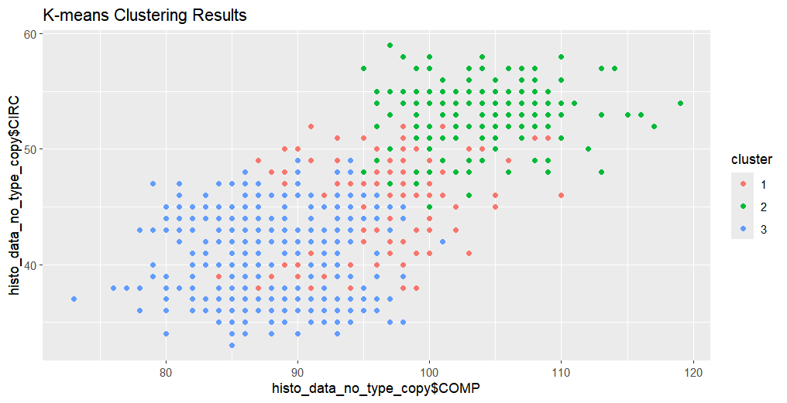

We can see that the K-means algorithm has successfully clustered the data into 3 distinct groups. The scatter plot shows the separation between the clusters, with each group clearly defined. This seems again logical as we have 3 types of vehicles to classify (bus, van, and cars).

### 3.2 Partitioning Around Medoids (PAM) Clustering

We also apply the Partitioning Around Medoids (PAM) algorithm to classify the data into clusters.

#### PAM Clustering with 2 Clusters

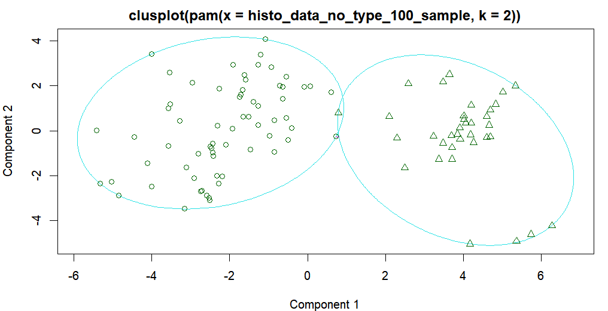
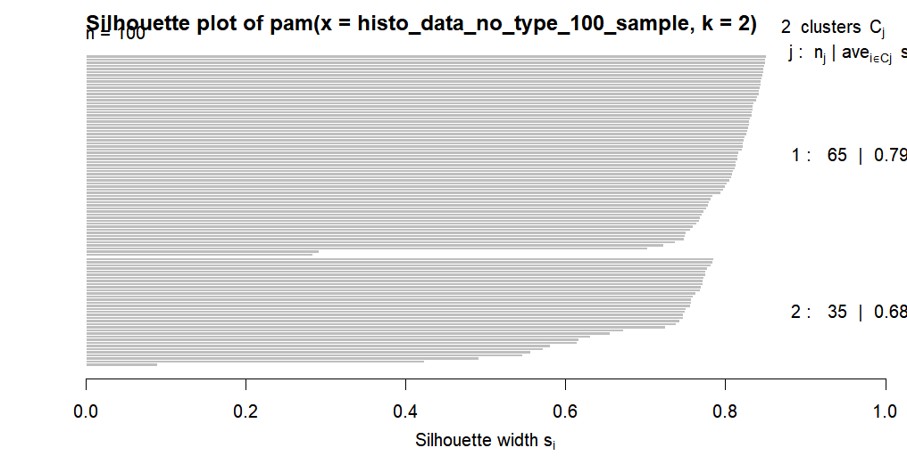

The PAM algorithm with 2 clusters shows a clear separation between the two groups. The silhouette plot indicates that the clusters are well-defined and distinct.

#### PAM Clustering with 3 Clusters

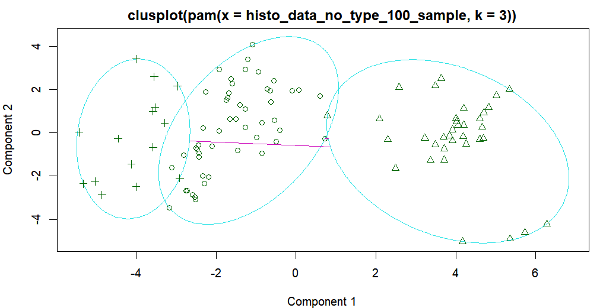
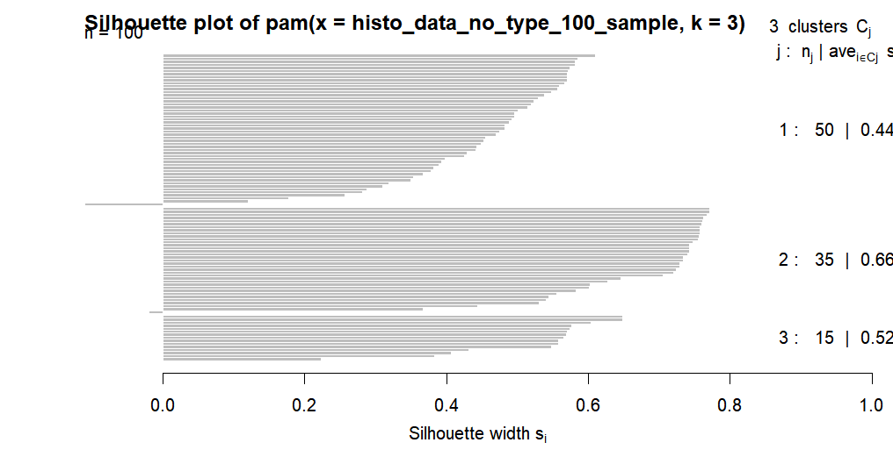

The PAM algorithm with 3 clusters also shows a clear separation between the groups. The silhouette plot confirms that the clusters are distinct and well-separated.

#### PAM Clustering with 4 Clusters

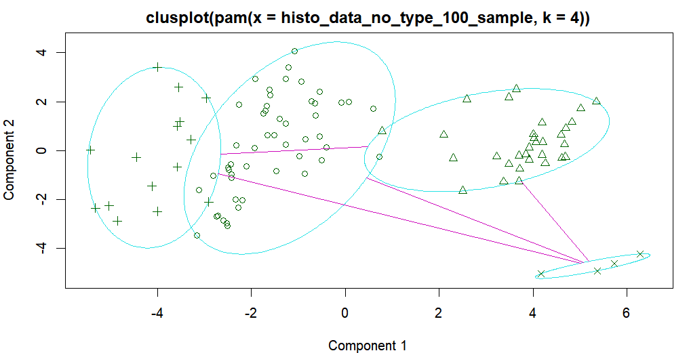
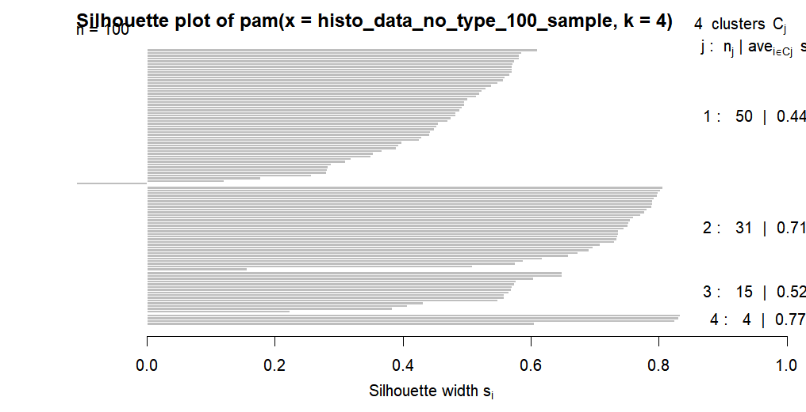

The PAM algorithm with 4 clusters further divides the data into more specific groups. The silhouette plot indicates that the clusters are still distinct and well-defined. But we do see some outliers in the cluster plot.

#### PAM Clustering results

After comparing the results of PAM clustering with 2, 3, and 4 clusters, we find that the 3-cluster solution provides the most meaningful and interpretable classification. 

First, it aligns with the number of vehicle types in the dataset (bus, van, and cars). Second, it offers a clear separation between the clusters, making it easier to identify the distinct groups.

The 2K PAM makes too much of a generalization, while the 4K PAM makes too much of a distinction (eg. the small group on the bottom right of the 4K PAM plot).

To add to this I've coded a small function that allows us to see the silhouette score for each K in the PAM algorithm. 

```r
calculate_silhouette <- function(data, max_clusters = 10) {
  silhouette_scores <- sapply(2:max_clusters, function(k) {
    km <- kmeans(data, centers = k)
    ss <- silhouette(km$cluster, dist(data))
    mean(ss[, 3])
  })
  plot(2:max_clusters, silhouette_scores, 
       type = "b", 
       xlab = "Number of Clusters", 
       ylab = "Average Silhouette Score")
}
```

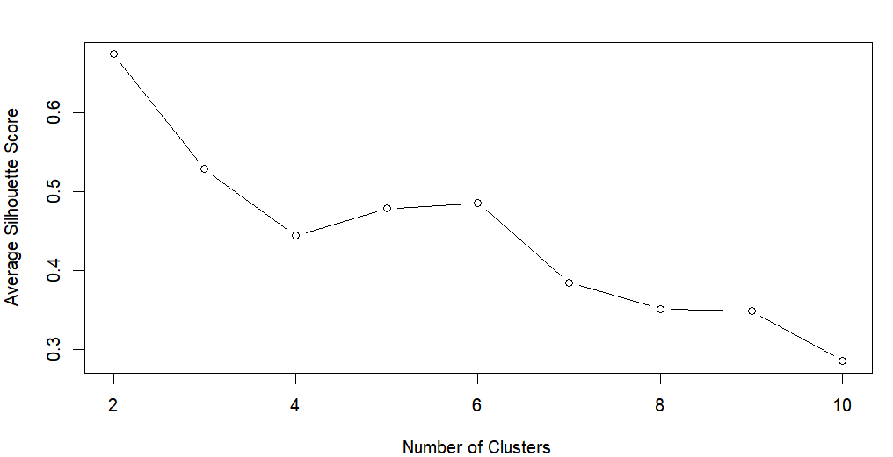

This graph shows that the silhouette score is highest for 2 clusters (which is not surprising as the silhouette score is a measure of how similar an object is to its own cluster compared to other clusters). But as we've seen before, 3 clusters is the most logical choice for this dataset and still has the second-highest silhouette score.

### 3.3 Classification Ascendante Hiérarchique (CAH)

The CAH algorithm is another unsupervised classification method that groups similar data points together. We apply the CAH algorithm to the dataset to identify distinct clusters.


We then cur the tree at 3 clusters to classify the data.
```r
cutTree_3_clust
  1   2   3 
376 214 162 
```

We can see well equilibrated clusters with the CAH algorithm (the 3 cluster choice of the CAH looks like the best choice for this dataset).

```r
cutTree_4_clust
 1   2   3   4 
376 206   8 162 
```

The 4 cluster choice of the CAH algorithm is not as good as the 3 cluster choice, we can see that the 3rd cluster only contains 8 elements, which is not enough to make a good classification (maybe the small group on the bottom right of the 4K PAM plot).

### 3.4 Reintegrate the class variable and interpret the results

#### 3.4.1 Cluster Quality Analysis
Looking at the contingency tables, we assess how well each clustering method corresponds to the true vehicle `TYPE` labels.  

---

#### 3.4.2 K-Means Clustering
```
    bus opel saab van
  1  32   42   52   3
  2  38   81   71   0
  3 126   67   66 174
```
##### **Observations**  
- **Cluster 3 is dominant for vans (174 vans)**, meaning K-Means successfully separates this category.  
- **Clusters 1 & 2 are mixed**, especially for *Opel* and *Saab*, indicating weaker separation.  
- The model struggles to isolate buses properly.  

##### **Verdict:** 🟡 *Moderate clustering*  
- Good for vans but poor separation for other classes.  

---

#### 3.4.2 PAM Clustering
```
    bus opel saab van
  1 108   60   63  78
  2  46   92   87   0
  3  42   38   39  99
```
##### **Observations**  
- **Cluster 2 groups Opels and Saabs well (92 & 87)** → Stronger separation than K-Means.  
- **Cluster 3 captures vans better than K-Means (99 vans) but still mixes some buses (42).**  
- **Cluster 1 contains a large mix of all categories** → Less pure than K-Means for vans.  

##### **Verdict:** 🟡 *Similar to K-Means, but better separation of Opels and Saabs.*  
- Still, some overlap in cluster assignments.  

---

#### 3.4.3 Hierarchical Clustering (CAH)
```
    bus opel saab van
  1  87   74   76 139
  2  41   86   81   6
  3  68   30   32  32
```
##### **Observations**  
- **Cluster 1 groups vans well (139), but with too many buses, Opels, and Saabs.**  
- **Cluster 2 captures Opel and Saab best (86 & 81) but misclassifies vans (6).**  
- **Cluster 3 mixes everything, especially buses (68).**  

##### **Verdict:** 🔴 *Worst performance overall*  
- **Most mixed clusters** → Poor ability to distinguish clear groups.  

---

### **Final Comparison**  
| Method  | Best for Vans | Best for Opels & Saabs | Best Overall Separation |
|---------|--------------|----------------------|-------------------------|
| **K-Means**  | ✅ (174 Vans) | ❌ (Mixed Opel/Saab) | 🟡 Moderate |
| **PAM**      | 🟡 (99 Vans)  | ✅ (92 Opel, 87 Saab) | 🟡 Moderate |
| **CAH**      | ❌ (139 Vans, mixed) | ✅ (86 Opel, 81 Saab) | 🔴 Poor |

#### **Best Choice:**
- **For van classification → K-Means (Cluster 3 captures 174 vans).**  
- **For Opel/Saab separation → PAM performs best (Clusters 2 & 3).**  
- **CAH performs the worst in distinguishing clusters.**  


## 4. Supervised classification

### 4.1 Classification with Decision Trees

We use the Decision Tree algorithm to classify the vehicles based on the dataset attributes. The Decision Tree model is trained on the dataset and used to predict the vehicle types.

Gather each independent variable

```r
bus_indices <- which(histo_data$TYPE == "bus")
opel_indices <- which(histo_data$TYPE == "opel")
saab_indices <- which(histo_data$TYPE == "saab")
van_indices <- which(histo_data$TYPE == "van")
```

Create a training set with 80% of the data

```r
sample(OUR_INDEX, round(0.8 * length(OUR_INDEX)))
```

Create the decision tree 

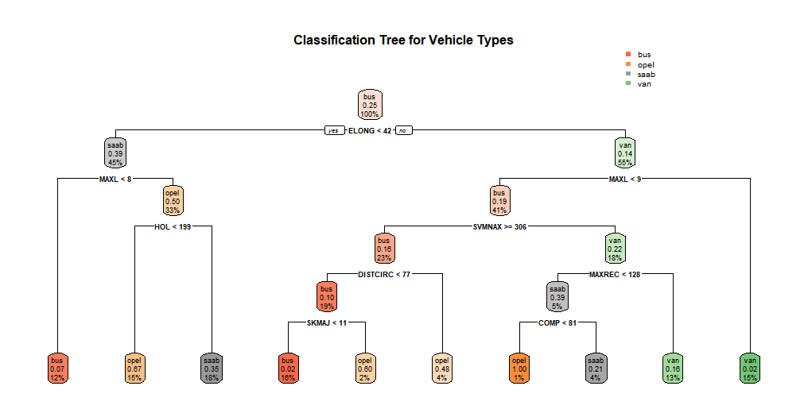

Main decision tree characteristics:
- **Root Node**: The first decision point based on the most significant attribute. (ELONGATEDNESS < 42) 
- **MAX.LENGTH.ASPECT.RATIO**: Subsequent decision points based on attribute values. The main are 
MAX.LENGTH.ASPECT.RATIO < 8 and < 9 that separates the first two branches.
- **SCALED VARIANCE ALONG MINOR AXIS**: This node separates 41% of the data. Is on SVMNAX >= 306.
- **HOLLOW.RATIO**: The next major decision point that further divides the branches. Is on HOL < 199 that separates 33% of the data.

The Decision Tree model provides a clear classification of the vehicles based on the dataset attributes. The tree structure shows the decision-making process for classifying the vehicles into different types.

Then we use the remaining 20% of the data to test the model and evaluate its accuracy.
```r
predictions bus opel saab van
       bus   37    3    7   2
       opel   1   17    9   0
       saab   0   16   17   3
       van    1    2    5  30
```

The confusion matrix shows the model's performance in classifying the vehicles. The diagonal elements represent the correct classifications, while the off-diagonal elements indicate misclassifications.

We then calculate the accuracy of the model based on the confusion matrix.

```r
accuracy <- sum(diag(confusion_matrix)) / sum(confusion_matrix)
```

We do get an accuracy of 67.33% which is quite good for a first model. And we can also add that the model is quite good in identifying buses and vans, but struggles a bit more to differenciate  Opel and Saab (Group of data in the center of the matrix). Well, this all makes sense, here are example of each type of vehicle:

- Bus: 

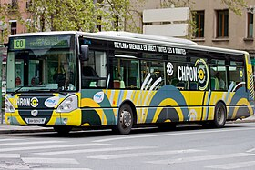
- Opel: 

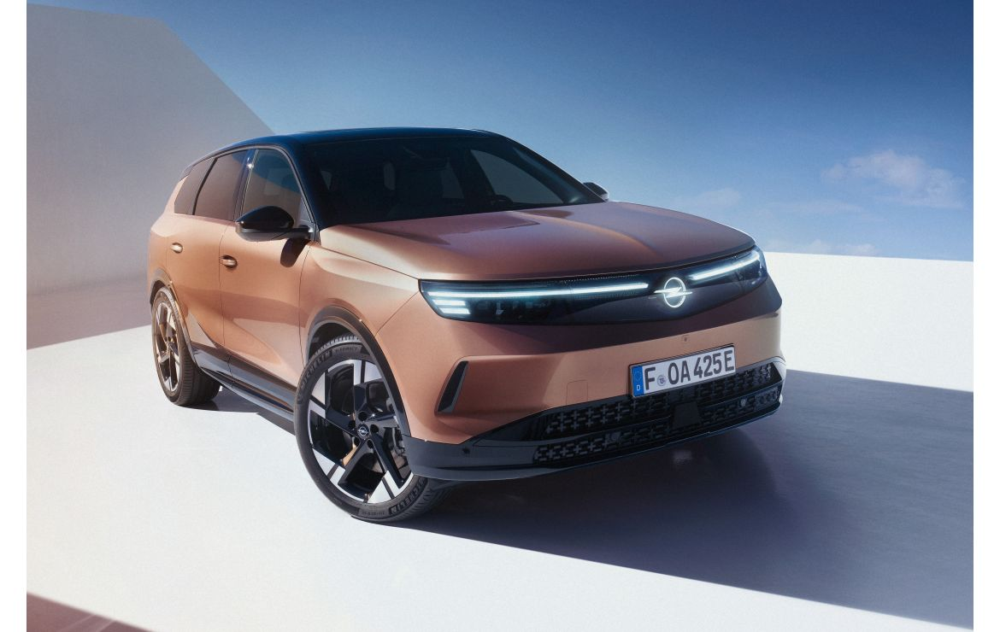
- Saab: 

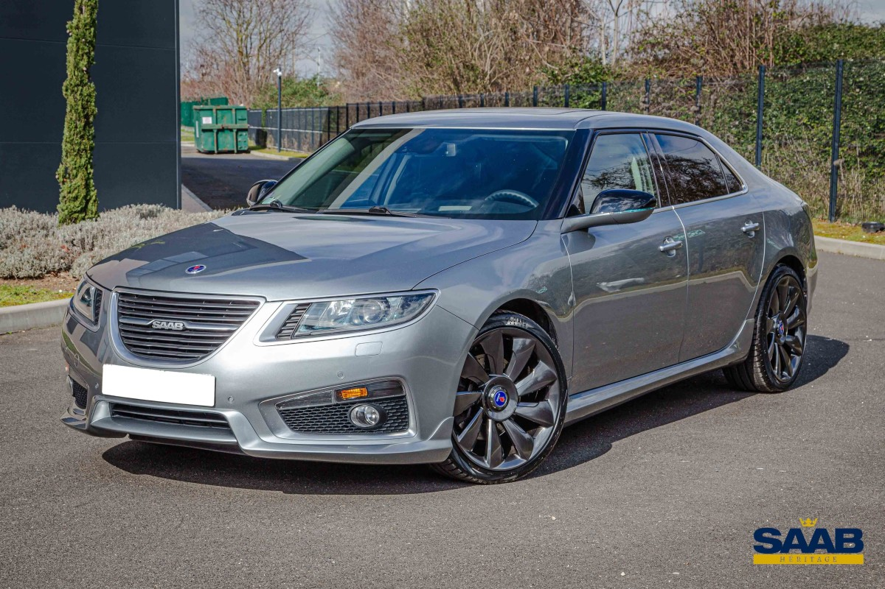
- Van: 

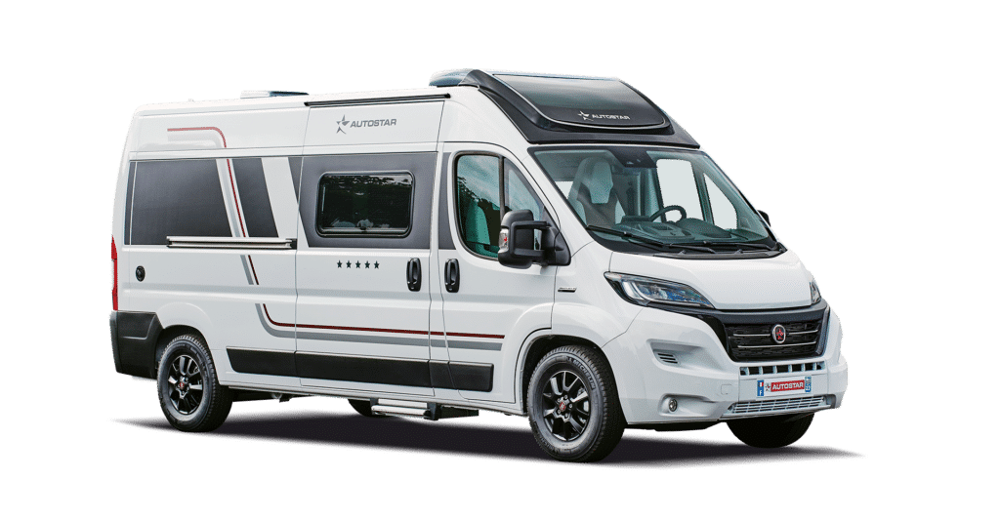


## 5. Conclusion

Here's a conclusion for your data analysis project:  

---

## 5. Conclusion  

This project explored the **Statlog (Vehicle Silhouettes) dataset**, aiming to distinguish between four types of vehicles (**bus, Opel, Saab, and van**) using **descriptive analysis, unsupervised clustering, and supervised classification**.  

### **Key Findings:**  
1. **Feature Importance:**  
   - Compactness, Circularity, and Axis Ratios were among the most relevant features for distinguishing vehicle types.  
   - Histograms and boxplots highlighted variations, especially between vans and cars.  

2. **Unsupervised Classification (Clustering):**  
   - **K-Means (3 clusters)** provided the best separation for vans but struggled with Opels and Saabs.  
   - **PAM (3 clusters)** performed slightly better in distinguishing car types.  
   - **CAH** was the least effective, producing mixed clusters.  

3. **Supervised Classification (Decision Trees):**  
   - Achieved **67.33% accuracy**, successfully identifying **buses and vans** but struggling to differentiate **Opel and Saab** (as expected).  
   - Key decision factors included **Elongatedness, Aspect Ratios, and Hollows Ratio**.  

### **Final Thoughts & Future Work:**  
- The clustering results confirm that **vans are the most distinguishable category**, while Opel and Saab are harder to separate.  
- The decision tree model provides **a solid baseline** but could be improved with **more advanced classifiers**

Overall, this project provides valuable insights into vehicle classification based on shape attributes and highlights both the strengths and limitations of different analytical approaches. 